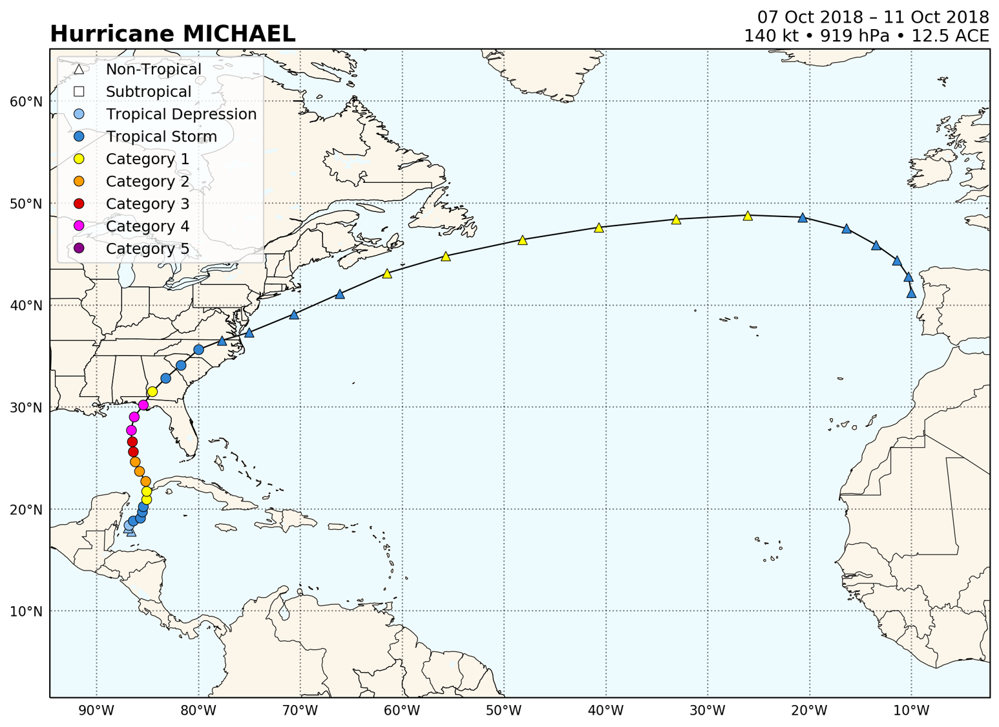
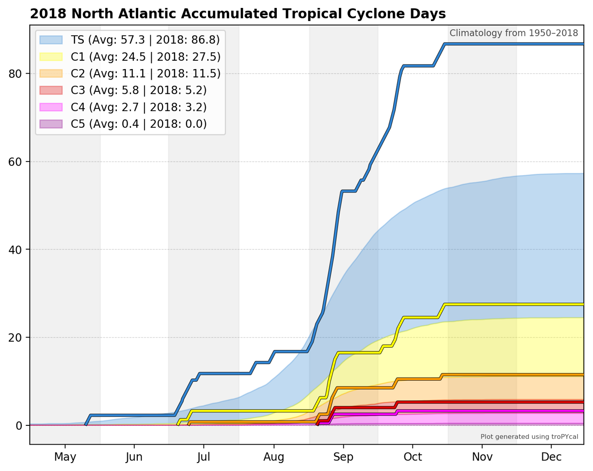

###################
TC Dataset Analysis
###################

This sample script illustrates how to create climatological analyses using HURDAT2 and IBTrACS.

.. code-block:: python

    import tropycal.tracks as tracks
    import datetime as dt

HURTDAT2 Dataset
----------------
Let's start with the HURDAT2 dataset by loading it into memory. By default, this reads in the HURDAT dataset from the National Hurricane Center (NHC) website, unless you specify a local file path using either ``atlantic_url`` for the North Atlantic basin on ``pacific_url`` for the East & Central Pacific basin.

HURDAT data is not available for the most recent hurricane seasons. To include the latest data up through today, the "include_btk" flag would need to be set to True, which reads in preliminary best track data from the NHC website.

Let's create an instance of a TrackDataset object, which will store the North Atlantic HURDAT2 dataset in memory. Once we have this we can use its methods for various types of analyses.

.. code-block:: python

    hurdat_atl = tracks.TrackDataset(basin='north_atlantic',source='hurdat',include_btk=False)

Retrieving storms and seasons
~~~~~~~~~~~~~~~~~~~~~~~~~~~~~

A TrackDataset object can be used to retrieve individual storms and seasons, using the following functionality:

.. code-block:: python

    #Retrieve Hurricane Michael from 2018
    storm = hurdat_atl.get_storm(('michael',2018))
    
    #Retrieve the 2017 Atlantic hurricane season
    season = hurdat_atl.get_season(2017)
    
If you remember the name of a storm but not the year, there is functionality to search for a list of years containing a storm of the requested name:

.. code-block:: python

    print(hurdat_atl.search_name('Michael'))
    
.. parsed-literal::

    [2000, 2012, 2018]

The previous example for a Storm object illustrated how to retrieve a single storm and make a plot of its observed track. This can also be done from a TrackDataset object, using the ``plot_storm()`` method.

Note that you can pass various arguments to the plot function, such as customizing the map and track aspects. The only cartopy projection currently offered is PlateCarree. Read through the documentation for more customization options.

.. code-block:: python

    hurdat_atl.plot_storm(('michael',2018))

Climatological analyses
~~~~~~~~~~~~~~~~~~~~~~~

A TrackDataset object can also be used to perform various climatological analyses. We'll start off with doing simple Accumulated Cyclone Energy (ACE) analyses.

Let's look at the cumulative year-to-date accumulated cyclone energy, with 2018 highlighted and compared against 2017:

.. code-block:: python

    hurdat_atl.ace_climo(plot_year=2018,compare_years=2017)

.. image:: ../_static/trackdataset_example_1.png
   :width: 75%
   :align: center

We can use the same function to perform a rolling sum, rather than a year-to-date sum. This highlights particularly active periods of tropical cyclone activity. We'll use the same function as before, but with a ``rolling_sum=30`` argument provided:

.. code-block:: python

    hurdat_atl.ace_climo(rolling_sum=30,plot_year=2018,compare_years=2017)

.. image:: ../_static/trackdataset_example_2.png
   :width: 75%
   :align: center

Plot cumulative hurricane days for all categories, with 2018 highlighted:

.. code-block:: python

    hurdat_atl.hurricane_days_climo(plot_year=2018)

Another climatological analysis available is a climatological correlation between maximum sustained wind and minimum mean sea level pressure (MSLP). While both variables are generally well correlated, factors such as background MSLP and MSLP gradient can affect this relationship.

This function plots the climatological correlation and distribution of wind-MSLP relationship, and can also plot individual storms for comparison against the climatology. We'll look at Hurricane Sandy (2012), which started out with a fairly typical wind-MSLP relationship, but towards the end of its life cycle ended up with an anomalously low MSLP given its sustained wind speed as it substantially grew in size.

.. code-block:: python

    hurdat_atl.wind_pres_relationship(storm=('sandy',2012))

.. image:: ../_static/trackdataset_example_4.png
   :width: 75%
   :align: center

Gridded Analyses
----------------

Tropycal also offers the capability of gridding tropical cyclone data into a structured latitude / longitude grid. This is done via the ``TrackDataset.gridded_stats()`` method. This method accepts multiple input arguments for various types of analyses. This example will show some of these capabilities.

Let's construct a 1 degree grid and plot the maximum sustained wind recorded at each gridpoint:

.. code-block:: python

    hurdat_atl.gridded_stats(cmd_request="maximum wind")

.. image:: ../_static/grid_example_1.png
   :width: 75%
   :align: center

IBTrACS Dataset
---------------

We can also read in IBTrACS data and use it the same way as we would use HURDAT2 data. There are caveats to using IBTrACS data, however, which are described more in depth in the :doc:`../data` page. We'll retrieve the global IBTrACS dataset, using the Joint Typhoon Warning Center (JTWC) data, modified with the Neumann reanalysis for southern hemisphere storms, and including a special reanalysis for Cyclone Catarina (2004) in Brazil.

.. warning::

    By default, IBTrACS data is read in from an online source. If you're reading in the global IBTrACS dataset, this could be quite slow. For global IBTrACS, it is recommended to have the CSV file saved locally (`link to data`_), then set the flag ``ibtracs_url="local_path"``.

.. _link to data: https://www.ncei.noaa.gov/data/international-best-track-archive-for-climate-stewardship-ibtracs/v04r00/access/csv/ibtracs.ALL.list.v04r00.csv

.. code-block:: python

    ibtracs = tracks.TrackDataset(basin='all',source='ibtracs',ibtracs_mode='jtwc_neumann',catarina=True)

In its current form, tropycal is not configured to support all types of analyses for global IBTrACS, particularly near the dateline. Future updates will work to improve this functionality.
